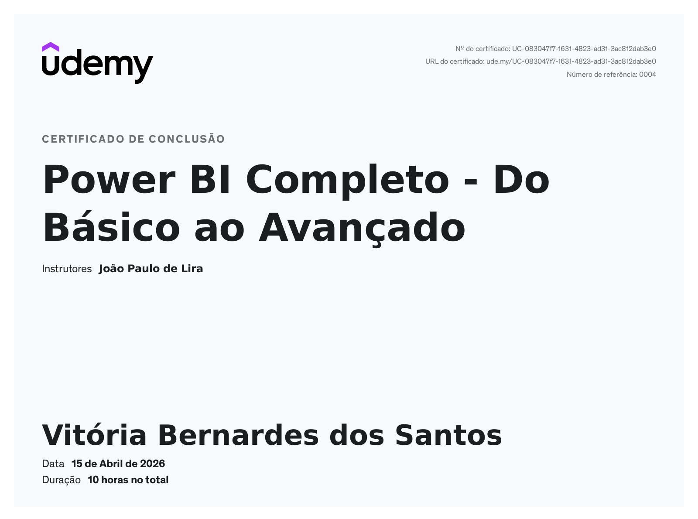

--- # Olá, eu sou a # Vitória 👋

📊 Analista de BI Júnior | Power BI • SQL • Excel • DAX

Transformo dados em insights que ajudam empresas a tomarem decisões melhores.

Tenho foco em entender o problema de negócio antes de iniciar qualquer análise — porque dados sem contexto são apenas números. Trabalho com análise exploratória, limpeza de dados, modelagem e construção de dashboards no Power BI.

---

## 📊 Projeto em destaque

### 📌 Dashboard de Vendas - Power BI

🔗 [https://github.com/Vitoriab51/dashboard-vendas-powerbi](https://github.com/Vitoriab51/dashboard-vendas-powerbi)

---

## 💡 Insights do Projeto

* A vendedora Ana apresentou maior faturamento
* A categoria Móveis lidera as vendas
* Crescimento ao longo do período analisado

---

## 🛠️ Ferramentas

* Power BI
* Excel
* DAX
---

## 📜 Certificados

### 📄 Certificado Power BI

### 📄 Certificado Excel

---
## 📫 Contato

🔗 LinkedIn: https://www.linkedin.com/in/vitoria-bernardes-2332b4345
